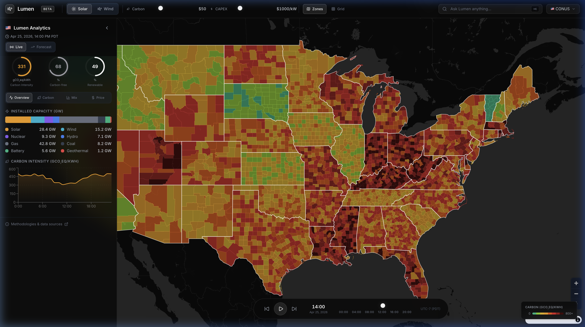
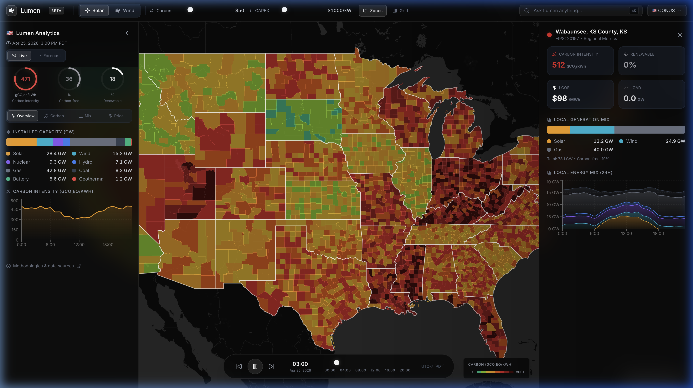

# Lumen — Renewable Energy Cost Optimization Intelligence Platform

## Product Requirements Document (PRD)

---

## 1. Problem Statement

Renewable energy developers, grid operators, corporate energy buyers, and policymakers face a deceptively hard question: **"Where should I build, buy, or schedule energy consumption to minimize cost given weather-dependent generation?"**

Today this requires stitching together weather forecasts (solar irradiance, wind speed), wholesale electricity market prices, grid carbon intensity, land/interconnection costs, and policy incentives — each living in a different API, format, and coordinate system. Consulting firms charge $50k+ for a single siting study. Corporate sustainability teams manually compare 3-4 candidate locations in spreadsheets. Grid operators lack a unified view of where surplus cheap renewables will exist 24-72 hours ahead.

**The gap:** No free, integrated tool lets you pose scenario-based questions like *"If I need 50 MW of clean power for a data center in the US Southeast, what are my 5 cheapest options factoring in solar yield, grid prices, and transmission access?"* — and get an interactive, map-based answer in seconds.

---

## 2. Core Insight

Renewable energy cost is fundamentally a **spatiotemporal optimization problem**. Existing tools show weather OR prices OR carbon intensity — never the **composite cost surface** that actually drives decisions.

Lumen visualizes a **unified cost-optimization layer** across geography and time: a living choropleth where every county represents modeled renewable energy metrics. Users define scenarios (technology type, capacity, time horizon) and explore optimal locations interactively.

---

## 3. Product Demo

### Dashboard Overview

The full platform showing county-level carbon intensity choropleth across 3,100+ US counties, analytics sidebar with installed capacity and carbon intensity charts, scenario controls (Solar/Wind, CAPEX, Carbon Price), and the floating time-series animation slider.



### Site Investigation Panel

Clicking any county opens a detailed investigation panel showing carbon intensity, LCOE, renewable percentage, load metrics, local generation mix breakdown, and 24-hour energy mix time series.



### Interactive Demo

Full interactive walkthrough: county selection → site panel → Solar/Wind toggle → time slider animation.


---

## 4. User Personas

1. **Alex, Renewable Energy Developer:** Evaluating candidate sites for a solar farm. Needs to compare expected generation yield, revenue, and capacity factor across counties.
2. **Riya, Corporate Energy Buyer:** Committed to 24/7 carbon-free energy. Needs to understand which regions offer the cheapest clean power at which hours.
3. **Marcus, Grid Planner:** Wants to identify regions where adding renewable capacity would reduce system cost most — the "triple win" zones.

---

## 5. What's Built (Frontend Implementation)

> **Important:** This is a frontend-focused implementation. All county-level data is **deterministically simulated** using state-level baselines from EIA (2026-02). No live weather APIs, real-time price feeds, or production ML models are connected. The backend serves as a thin scoring layer for the simulated data.

### Shipped Features

| # | Feature | Implementation Details |
|---|---|---|
| 1 | **County-level choropleth map** | MapLibre GL JS rendering 3,100+ US counties from Census GeoJSON. Each county colored by simulated carbon intensity using an 8-color discrete palette (emerald → dark red). Colors derived from real EIA state-level fossil fuel percentages with per-county random variance. |
| 2 | **Technology selector** | Solar PV / Onshore Wind toggle in the top bar. Switching technology recalculates grid cells and updates scenario parameters. |
| 3 | **Scenario configurator** | CAPEX slider ($500–$3000/kW) and Carbon Price slider ($0–$200/ton) in the top bar. Changes trigger recalculation of the grid cell scoring. |
| 4 | **Site investigation panel** | Click any county → right panel slides in showing: carbon intensity (gCO₂/kWh), LCOE ($/MWh), renewable %, load (GW), generation mix bar chart, and 24h energy mix area chart. All values are **simulated** from the deterministic county engine. |
| 5 | **AI site assessment brief** | Template-based text generation (not LLM-powered). Produces a brief with capacity factor, LCOE, margin analysis, carbon displacement, and risk assessment from structured metrics. |
| 6 | **Time-series animation** | Floating pill-shaped slider at bottom center. Play/pause/scrub through a 24-hour simulated time window. Updates left sidebar metrics. |
| 7 | **Analytics sidebar** | Left panel with: carbon intensity / carbon-free / renewable ring gauges, installed capacity bar, 4 tabbed views (Overview, Carbon, Mix, Price) each with Recharts visualizations. Data is **mock time-series** — not connected to live feeds. |
| 8 | **NL query bar** | UI shell exists in the top bar ("Ask Lumen anything..."). **Not functional** — no LLM or parser is connected. |
| 9 | **Layer toggles** | Zones and Grid toggle buttons in top bar to switch between map visualization modes. |

### Data Sources Used

| Source | What We Used | How |
|---|---|---|
| **EIA Open Data** (2026-02) | State-level avg electricity cost, % solar, % wind, % hydro, % fossil for all 50 states | Hardcoded into `stateData.ts` / `state_data.py` as baseline profiles |
| **US Census Bureau** | County boundaries (GeoJSON) and state boundaries (GeoJSON) | Static files in `public/data/` rendered by MapLibre |

> **Not connected:** NOAA GFS weather, NASA POWER, Electricity Maps, EPA eGRID, EIA-860, HIFLD transmission. These are planned for future integration.

### How the Simulated Data Works

1. Each county's FIPS code seeds a deterministic pseudo-random number generator (LCG)
2. The state's real EIA fossil fuel percentage sets the carbon intensity baseline (`fossil% × 8 = gCO₂eq/kWh`)
3. Random variance (±40%) is applied per-county so adjacent counties show different colors
4. LCOE, renewable %, price, and generation mix are similarly derived from the state baseline + county variance
5. The same LCG algorithm runs identically in both the frontend (`zones.ts`) and backend (`county_store.py`) so the map colors match the API responses

---

## 6. Technical Architecture

```
┌─────────────────────────────────────────────────────────┐
│  Frontend  (React 18 + TypeScript + Vite)               │
│                                                         │
│  MapLibre GL JS ── county choropleth (GeoJSON)          │
│  Recharts ──────── sidebar & panel charts               │
│  Zustand ───────── state management                     │
│  Framer Motion ─── animations                           │
│  zones.ts ──────── client-side county data (LCG)        │
│  stateData.ts ──── EIA state profiles (hardcoded)       │
└──────────────────────┬──────────────────────────────────┘
                       │ fetch (REST)
┌──────────────────────┴──────────────────────────────────┐
│  Backend  (FastAPI + Python)                            │
│                                                         │
│  /county/{fips} ── returns simulated site metrics       │
│  /brief ────────── template-based assessment text       │
│  /query ────────── stub (not implemented)               │
│  county_store.py ─ same LCG as frontend                 │
│  state_data.py ─── same EIA profiles as frontend        │
│  scoring.py ────── LCOE/CRF arithmetic                  │
└─────────────────────────────────────────────────────────┘
```

### Tech Stack

| Layer | Technology |
|---|---|
| **Frontend** | React 18, TypeScript, Vite, MapLibre GL JS, Recharts, Zustand, Framer Motion, Tailwind CSS |
| **Map tiles** | MapTiler free tier |
| **Backend** | Python 3.11, FastAPI, uvicorn, NumPy |
| **Data** | Hardcoded EIA state profiles, Census GeoJSON |

---

## 7. What's Not Built (Future Work)

| Feature | Description | Blocked By |
|---|---|---|
| **Real weather data** | NOAA GFS solar irradiance & wind speed ingestion | API integration + `xarray`/`cfgrib` pipeline |
| **Live electricity prices** | EIA API real-time wholesale prices by hub | EIA API key + data normalization |
| **Real carbon intensity** | Electricity Maps or EPA eGRID real values | API integration |
| **PVWatts solar model** | Physics-based solar generation from irradiance | Requires GFS data |
| **IEC wind model** | Power curve lookup for wind generation | Requires GFS wind data |
| **LLM-powered briefs** | Claude/GPT-4o-mini for rich site assessments | API key + prompt engineering |
| **NL query parser** | Natural language → structured filters | LLM function-calling |
| **Comparison mode** | Side-by-side 2–3 site comparison | UI + data model |
| **Transmission overlay** | HIFLD transmission line visualization | GeoJSON integration |
| **Portfolio optimizer** | Budget → optimal solar+wind mix | `scipy.optimize.linprog` |

---

## 8. Design Principles

- **Dark mode first** — Professional, high-contrast dark theme (#0a0a0a base)
- **Glassmorphism** — Frosted glass panels with `backdrop-filter: blur(24px)`
- **No gradient colors** — Discrete, flat 8-color palette for the map choropleth
- **Floating controls** — Time slider is a pill-shaped floating element, not a footer bar
- **Micro-animations** — Framer Motion spring physics for all panel transitions
- **Typography** — Inter font family, tight tracking, tabular numbers for metrics

---

## 9. Metrics

| Metric | Value |
|---|---|
| Counties rendered | 3,143 |
| Production bundle (gzipped) | 434 KB |
| TypeScript errors | 0 |
| Map render time | <1s |
| Panel load (with API call) | <500ms |
