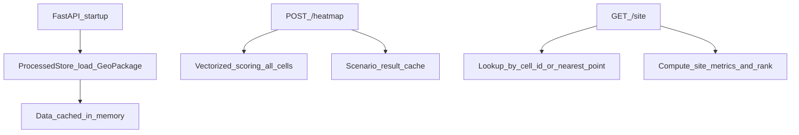

# Lumen API Harness (Backend)

This document explains how Lumen’s backend “API harness” works: what data it expects, what endpoints it exposes, how scoring is computed, and how to extend the system safely.

## Quick start

### 1) Install and run

```bash
python -m venv .venv
source .venv/bin/activate
pip install -r requirements.txt

cp .env.example .env
uvicorn backend.app.main:app --reload
```

On startup the API attempts to load the processed artifact at `PROCESSED_DATASET_PATH`. If the file is missing, the server still starts, but `/heatmap` and `/site` will return `503` until the dataset exists.

### 2) Validate your processed dataset

```bash
python scripts/validate_processed_artifact.py ./data/processed/lumen_cells.gpkg
```

## Design overview

### What this API is (and is not)

- **Is**: a fast, local-first scoring service that turns a *precomputed* spatial grid into scored “cells” for Deck.gl rendering, plus a site detail endpoint for investigation panels.
- **Is not**: the raw data ingestion pipeline (NOAA/EIA/etc.). Pipelines run offline and produce a single processed artifact file that the API loads.

### Why “scored cells”, not “heatmap”

Even though the endpoint is named `POST /heatmap`, the backend returns **generic scored cells**:

- Deck.gl can render the same payload as a `GridCellLayer`, `ScatterplotLayer`, a density/heatmap layer, or later an H3-based layer.
- The backend is agnostic to how the frontend visualizes the scores.

## Processed artifact contract (GeoPackage)

The backend expects a **GeoPackage** file (default `./data/processed/lumen_cells.gpkg`) containing a layer named:

- **Layer**: `lumen_cells`

### Required columns

- **`cell_id`**: unique identifier (string or int)
- **`lat`**: centroid latitude (float)
- **`lon`**: centroid longitude (float)
- **`solar_cf_mean`**: mean solar capacity factor in \([0, 1]\)
- **`wind_cf_mean`**: mean wind capacity factor in \([0, 1]\)
- **`price_usd_per_mwh_mean`**: mean wholesale price (USD/MWh)
- **`carbon_g_per_kwh_mean`**: mean grid carbon intensity (gCO₂/kWh)

### Optional columns

- **`nearest_transmission_km`**: distance to transmission (km)
- **`price_hub_id`**: identifier for the nearest price node/hub
- **`grid_zone_id`**: balancing authority / grid zone identifier

### Geometry

- `geometry` is optional for the API but recommended.
- If present, it should be a Point geometry in **EPSG:4326**.
- The API uses geometry for nearest-neighbor lookup in `GET /site?lat=...&lon=...`.

## Runtime flow



## Endpoints

### `GET /health`

Returns a basic status and whether the processed store is loaded.

Example:

```bash
curl -s http://localhost:8000/health
```

### `POST /heatmap`

Returns scored cells for map rendering. Payload is a scenario configuration.

Example:

```bash
curl -s http://localhost:8000/heatmap \
  -H "content-type: application/json" \
  -d '{
    "technology": "solar",
    "capacity_mw": 50,
    "capex_usd_per_kw": 1200,
    "opex_usd_per_kw_year": 35,
    "discount_rate": 0.06,
    "project_lifetime_years": 25,
    "carbon_price_usd_per_ton": 50,
    "cost_weight": 1.0,
    "revenue_weight": 1.0,
    "carbon_weight": 1.0
  }'
```

Response highlights:

- `cells[]`: array of `cell_id`, `lat`, `lon`, `score`, and raw components
- `score_min` / `score_max`: useful for frontend color scaling

### `GET /site`

Returns detailed metrics for a specific cell, plus its rank among all cells for the given scenario.

Lookup by `cell_id`:

```bash
curl -s "http://localhost:8000/site?cell_id=tx_001&technology=solar"
```

Lookup nearest to lat/lon:

```bash
curl -s "http://localhost:8000/site?lat=31.9686&lon=-99.9018&technology=solar"
```

## Scoring model (MVP)

The scoring engine is implemented in `backend/app/engine/scoring.py` and is intentionally vectorized (NumPy) for speed.

### Components

- **Capacity factor**: uses `solar_cf_mean` or `wind_cf_mean` depending on `technology`.
- **LCOE (USD/MWh)**:

  \[
  LCOE = \frac{CAPEX\_{kW} \cdot CRF + OPEX\_{kW/yr}}{CF \cdot 8760} \cdot 1000
  \]

- **Revenue (USD/MWh)**: MVP proxy = `price_usd_per_mwh_mean`
- **Carbon value (USD/MWh)**:

  - Convert intensity from gCO₂/kWh to tons/MWh: \( \text{tons/MWh} = \text{g/kWh} / 1000 \)
  - Multiply by carbon price: \( \text{USD/MWh} = \text{tons/MWh} \cdot \$/ton \)

### Composite score

\[
Score = w_1 \cdot LCOE - w_2 \cdot Revenue - w_3 \cdot CarbonValue
\]

- **Lower score = better**
- Changing weights reorders the surface without re-running ingestion.

## Caching and performance

To hit “sub-200ms” goals on ~3,500 cells:

- The processed artifact is loaded once into memory (`ProcessedStore`).
- `POST /heatmap` computes scores vectorized, and uses a small in-process LRU cache keyed by scenario parameters.

If you later scale up to >100k cells or add hourly series, consider:

- DuckDB-backed queries for filtering and aggregation
- Precomputing additional derived features (price correlation, curtailment risk)
- Returning only a viewport subset / tiled responses

## Extension guide

### Adding a new derived metric

1. Add the column to the processed artifact (pipeline-owned)
2. Add it to the contract if required (`backend/app/data/contracts.py`)
3. Consume it in the scorer (`backend/app/engine/scoring.py`)
4. Plumb it into API responses (`backend/app/schemas/scenario.py`)

### Adding a new endpoint

Pattern used in this repo:

- **Schemas**: `backend/app/schemas/...`
- **Service**: `backend/app/services/...` (pure-ish business logic)
- **Route**: `backend/app/api/routes.py` (HTTP boundary + error mapping)

### Adding new visualization types (Deck.gl)

No backend changes required if the new layer can use:

- `lat`, `lon`, `score`

If a layer needs extra fields (e.g., `radius`, `weight`, or H3 index), add them to `ScoredCell` and produce them in the scorer or processed artifact.

